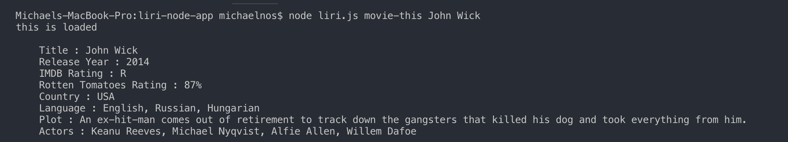
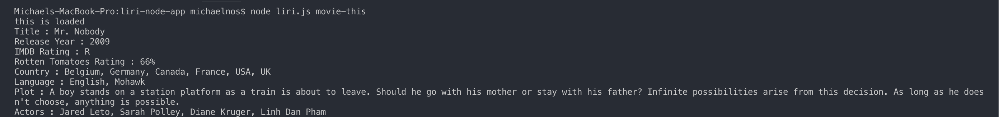

# LIRI-node-app

### Overview

This app allows the user to search information on songs, movies or concerts. Information is pulled from a variety of API's and will display relevant information.

### How It Works

The user is given 4 different commands to choose from :

- concert-this
- movie-this
- spotify-this-song
- do-what-it-says

Each command should be followed by the users search for the command (Ex : "movie-this John Wick"). For the movie and spotify commands, if the user has no search preference than it has a default search it'll fall back on. To execute a search, you must first type "node liri.js" before your desired command and search.

### Technology

This app is developed with Node.js. External packages have been installed to allow the app to function properly. Packages used in development for this app include :

- fs
- axios
- node-spotify-api
- moment

### Demo

Concert search

Spotify search with user input

Spotify search without user input

Movie search with user input

Movie search without user input

Searches based on command in log file

